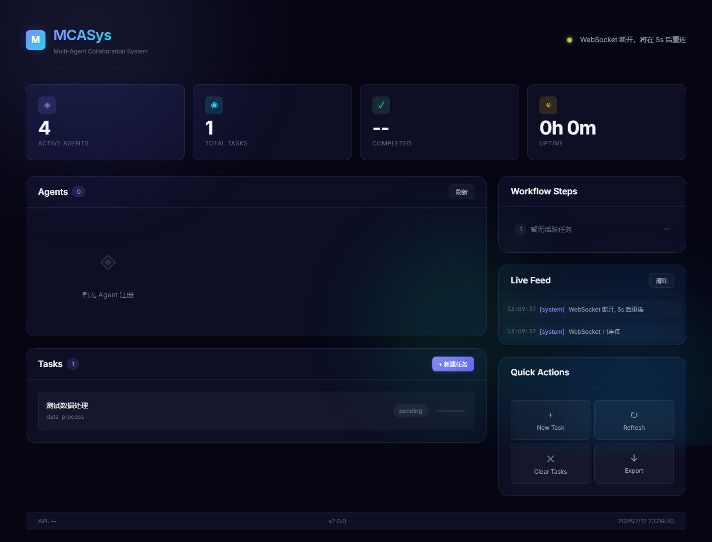

# MCASys — 多Agent协作系统 v2.0

<p align="center">
  
</p>

**MCASys** 是一个生产级多 Agent 协作框架，提供完整的 REST API + 实时 WebSocket 事件总线 + 美观的 Dark Mode Dashboard。

> 架构借鉴 kimi-cli（Python）、kimi-code（TypeScript）、ScriptForge（Java）的生产级设计模式。

---

## 核心特性

| 特性 | 说明 |
|:--|:--|
| **异步事件总线** | 发布/订阅模式，Agent 间实时解耦通信 |
| **任务调度器** | 后台异步调度循环，按类型/负载智能分配 |
| **统一返回类型** | `AgentResult` 替代裸 dict，结构化错误传递 |
| **泛型重试框架** | `RetryTemplate` 指数退避重试，同步/异步双模式 |
| **Swarm 并行调度** | 批量并发子任务，两阶段调度（正常+限速） |
| **Kaos 环境抽象** | 文件系统/进程统一接口，支持本地/远程透明切换 |
| **Server 锁机制** | 文件互斥锁 + PID 存活检测 + 过期接管 |
| **DI 容器** | ServiceCollection 注册表 + 单例/延迟实例化管理 |
| **流式步骤跟踪** | `StreamTracker` start/update/end 三步 API |
| **FastAPI REST API** | 15 个端点 + WebSocket 实时推送 + Bearer 认证 |
| **Dark Dashboard** | Glassmorphism + Bento Grid + 实时轮询 + WebSocket |

---

## 快速开始

### 环境要求

- Python 3.9+
- Windows / Linux / macOS

### 安装

```bash
# 克隆项目
git clone https://github.com/lxy3837/MultiCoopAgentSystem
cd MCASys

# 安装依赖
pip install -r requirements.txt
```

### 启动

```bash
# 设置 API Key（默认自动生成）
set MCASYS_API_KEY=your-secret-key   # Windows CMD
$env:MCASYS_API_KEY = "your-secret-key"  # PowerShell
export MCASYS_API_KEY=your-secret-key    # Linux/macOS

# 启动 FastAPI 服务
python run_fastapi.py
```

启动后访问:
- **Dashboard**: http://localhost:8000
- **API 文档 (Swagger)**: http://localhost:8000/docs
- **Streamlit UI**: http://localhost:8501（需额外 `streamlit run streamlit_app/main_page.py`）

---

## API 端点

所有 `/api/v1/*` 端需要 Bearer Token: `Authorization: Bearer <key>`

### 系统

| 方法 | 路径 | 说明 | 认证 |
|:--|:--|:--|:--|
| GET | `/` | Dashboard 页面 | 否 |
| GET | `/healthz` | 存活探针 | 否 |
| GET | `/readyz` | 就绪探针 | 否 |
| GET | `/docs` | Swagger API 文档 | 否 |
| WebSocket | `/ws/events` | 实时事件推送 | 否 |

### Agent 管理

| 方法 | 路径 | 说明 |
|:--|:--|:--|
| GET | `/api/v1/agents` | 获取所有 Agent |
| GET | `/api/v1/agents/{agent_id}` | 获取单个 Agent |
| POST | `/api/v1/agents/{agent_id}/start` | 启动 Agent |
| POST | `/api/v1/agents/{agent_id}/stop` | 停止 Agent |

### 任务管理

| 方法 | 路径 | 说明 |
|:--|:--|:--|
| GET | `/api/v1/tasks` | 获取所有任务 |
| GET | `/api/v1/tasks/{task_id}` | 获取单个任务 |
| POST | `/api/v1/tasks` | 创建任务 |
| PUT | `/api/v1/tasks/{task_id}/status` | 更新任务状态 |
| DELETE | `/api/v1/tasks/{task_id}` | 删除任务 |

### 系统信息

| 方法 | 路径 | 说明 |
|:--|:--|:--|
| GET | `/api/v1/system/stats` | 系统统计 |
| GET | `/api/v1/system/events` | 事件历史 |

---

## 项目结构

```
MCASys/
├── app.py                 # FastAPI 主入口（15个端点 + WebSocket）
├── main.py                # Agent 系统初始化
├── run_fastapi.py         # Uvicorn 启动脚本
├── requirements.txt
│
├── core/                  # ★ 核心基础设施层
│   ├── event_bus.py       # 异步发布/订阅事件总线
│   ├── runtime.py         # 全局运行时上下文（DB + EventBus + Scheduler）
│   ├── scheduler.py       # 后台任务调度循环
│   ├── database.py        # SQLAlchemy 异步数据库管理
│   ├── models.py          # ORM 模型（TaskModel, AgentStateModel）
│   ├── repository.py      # Repository 数据访问层
│   ├── security.py        # API Key 认证
│   ├── result.py          # AgentResult 统一返回类型
│   ├── retry.py           # RetryTemplate 泛型重试框架
│   ├── swarm.py           # SwarmBatch 并行批量调度
│   ├── stream_tracker.py  # StreamTracker 步骤流式跟踪
│   ├── di.py              # DI 容器（ServiceCollection + Container）
│   ├── lock.py            # Server 文件互斥锁
│   └── kaos/              # Kaos 环境抽象层
│       ├── _base.py       # ABC 基类 + 类型 + 错误
│       └── local.py       # LocalKaos 实现
│
├── agents/                # Agent 实现
│   ├── base_agent.py      # Agent 抽象基类
│   └── specialized_agents/
│       ├── coordinator_agent.py  # 协调 Agent（事件监听）
│       ├── executor_agent.py     # 执行 Agent
│       └── analyzer_agent.py     # 分析 Agent
│
├── collaboration/         # 协作逻辑
│   ├── conflict_resolver.py
│   ├── state_manager.py
│   └── task_allocation.py
│
├── frontend/              # ★ Web Dashboard
│   ├── index.html         # Dashboard 页面
│   ├── styles.css         # Dark Mode 2.0 样式
│   └── app.js             # 前端逻辑（轮询 + WebSocket）
│
├── streamlit_app/         # Streamlit UI（备选前端）
├── config/                # 配置文件（YAML）
├── data/                  # 数据模型 & 管理
├── utils/                 # 工具函数（日志等）
├── tests/                 # 测试用例
└── docs/
    └── screenshots/       # 项目截图
```

---

## 架构对比

从 kimi-cli、kimi-code、ScriptForge 三个项目中借鉴的核心模式：

| 来源 | 借鉴模式 | MCASys 实现 |
|:--|:--|:--|
| **kimi-cli** (Python) | EventBus / Runtime / Scheduler | `core/event_bus.py`, `core/runtime.py`, `core/scheduler.py` |
| **kimi-code** (TypeScript) | Kaos 环境抽象 / Swarm 并行调度 / Server 锁 / DI | `core/kaos/`, `core/swarm.py`, `core/lock.py`, `core/di.py` |
| **ScriptForge** (Java) | AgentResult / RetryTemplate / StreamTracker | `core/result.py`, `core/retry.py`, `core/stream_tracker.py` |

---

## 使用示例

### 创建任务

```bash
curl -X POST http://localhost:8000/api/v1/tasks \
  -H "Authorization: Bearer mcasys-dev-key" \
  -H "Content-Type: application/json" \
  -d '{"name": "数据分析", "task_type": "analysis", "description": "分析 CSV 数据"}'
```

### WebSocket 监听

```javascript
const ws = new WebSocket('ws://localhost:8000/ws/events');
ws.onmessage = (e) => console.log(JSON.parse(e.data));
```

### 代码中使用 AgentResult

```python
from core.result import AgentResult
from core.retry import RetryTemplate

@retry(max_retries=3)
def process_data(filepath: str) -> AgentResult:
    try:
        data = read_csv(filepath)
        return AgentResult.ok(data={"rows": len(data)}, msg="处理成功")
    except Exception as e:
        return AgentResult.fail(msg="处理失败", error=str(e))
```

### 使用 StreamTracker

```python
from core.stream_tracker import StreamTracker

tracker = StreamTracker("project_001")

with tracker.track("step_1", "数据加载"):
    load_data()  # 自动 start/end，失败自动标记 failed
```

---

## 运行测试

```bash
pytest tests/ -v
```

---

## 许可证

MIT License · [GitHub](https://github.com/lxy3837/MultiCoopAgentSystem)
