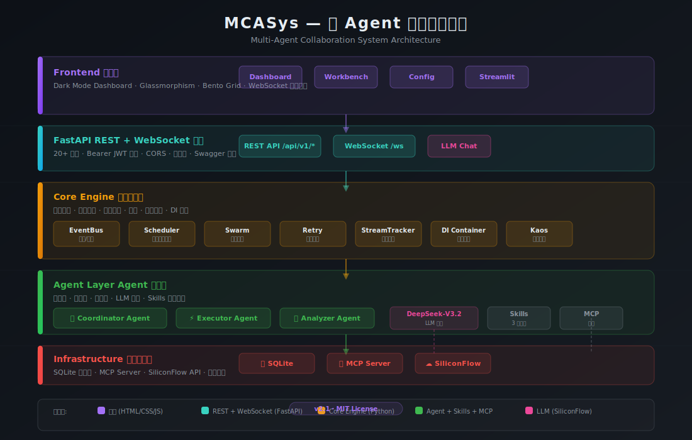
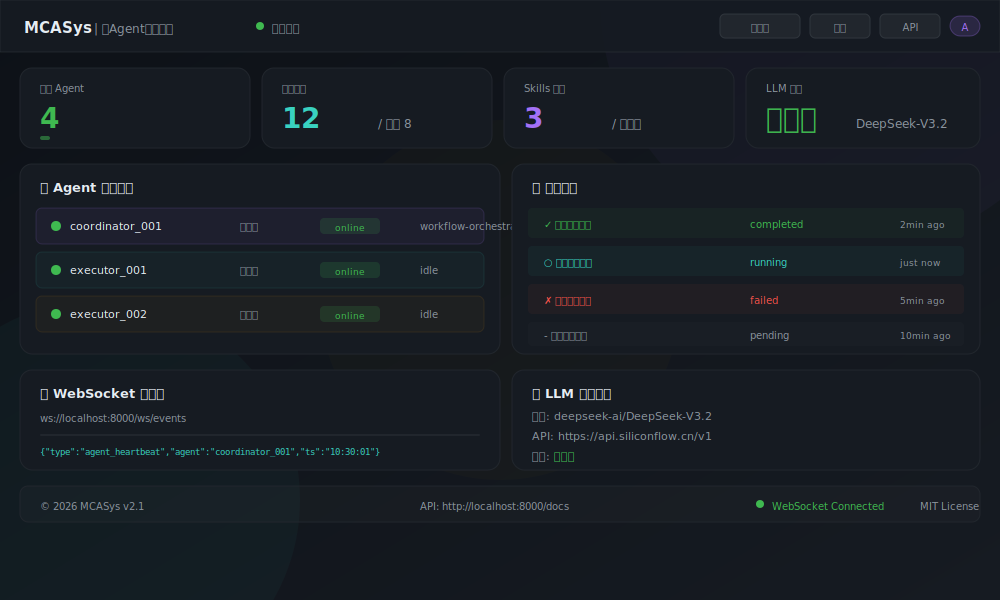
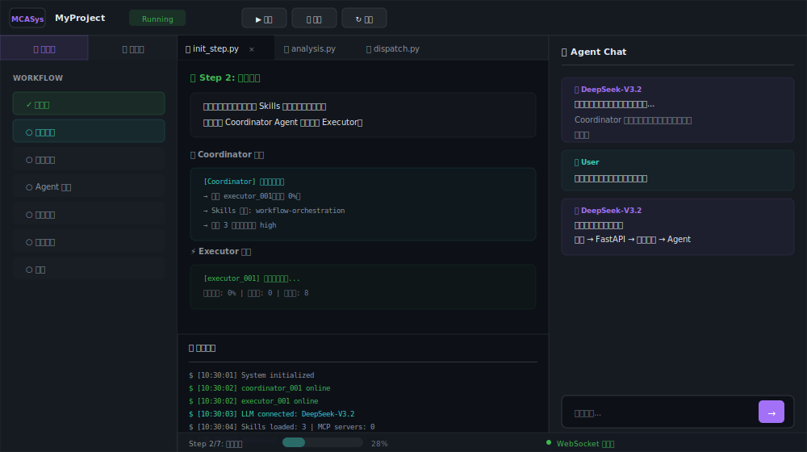
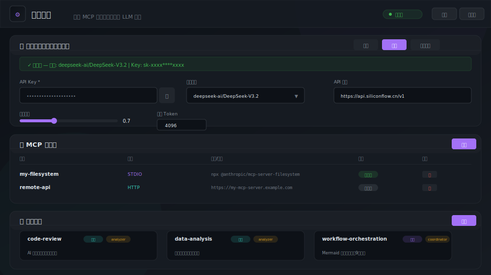
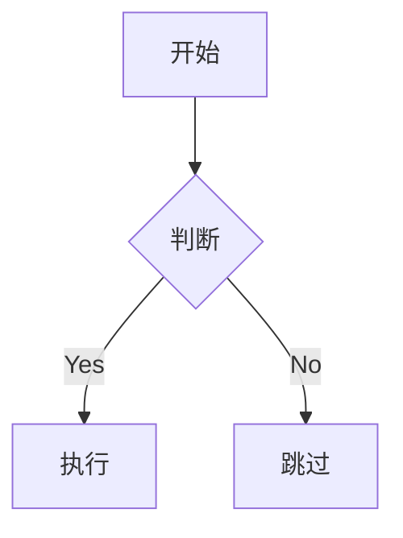

# MCASys — 多Agent协作系统 v2.1

<p align="center">
  
</p>

<p align="center">
  <strong>生产级多 Agent 协作框架</strong> · REST API + WebSocket · 工作台 IDE · Skills · MCP · LLM 集成
</p>

<p align="center">
  
  
  
  
  
</p>

---

## 概览

**MCASys** 是一个完整的多 Agent 协作框架，集成 **Skills 技能系统**、**MCP 协议**、**DeepSeek-V3.2 LLM**，提供生产级 REST API + WebSocket + 美观的 Dark Mode 多界面。

> 参考架构：kimi-cli（Python EventBus）、kimi-code（TypeScript Kaos/Swarm）、ScriptForge（Java Retry/DI）

---

## 界面截图

<p align="center">
  
  
  
  
</p>

从左到右、从上到下：Dashboard 首页 · 工作台 IDE · 系统配置 · 五层架构图

---

## 新功能 (v2.1)

### 🧠 LLM 大模型集成
- **硅基流动 API** 驱动，默认 DeepSeek-V3.2
- 多模型支持：DeepSeek-R1、Qwen2.5-72B、GLM-4 等
- 网页端配置，保存即时生效（热加载），无需重启
- Agent 自动感知 LLM 可用性，智能推理 vs 模拟回退

### 🖥️ 工作台 IDE (Workbench)
- 三栏 IDE 布局：步骤树 + 编辑区 + Agent 对话
- 7 步工作流可视化（初始化→分析→分发→执行→收起→审核→完成）
- 内嵌 AI Chat（对接 DeepSeek-V3.2），支持多轮对话
- 底部可拖拽 输出日志面板 + 状态栏

### ⚙️ 系统配置中心
- **LLM 配置**：API Key 输入（密码框+显隐切换）、模型下拉选择、温度滑块、Max Token
- **MCP 管理**：服务器表格 CRUD、测试连接、STDIO/HTTP 双模式
- **Skills 浏览**：卡片网格 + 详情弹窗（含流程图和提示词）
- **系统信息**：版本号、在线 Agent、事件订阅、API Key 状态

### 🧩 Skills 技能系统
- 三级分层覆盖：内置 → 用户级 → 项目级
- `SkillManager.discover_skills()` 自动发现加载
- 3 个内置技能：`code-review`、`data-analysis`、`workflow-orchestration`
- Agent 启动时自动匹配技能、注入系统提示词

### 🔌 MCP 协议
- `MCPClientManager`：STDIO 子进程 + HTTP 双传输
- `MCPServer`：MCASys 自身暴露 5 个 MCP 工具
- JSON-RPC 2.0 完整实现：initialize → tools/list → tools/call

---

## 快速开始

### 前置条件

- Python 3.9+
- （可选）硅基流动 API Key → [siliconflow.cn](https://siliconflow.cn) 注册获取

### 安装 & 启动

```bash
# 克隆项目
git clone https://github.com/lxy3837/MultiCoopAgentSystem
cd MCASys

# 安装依赖
pip install -r requirements.txt

# 启动服务
$env:MCASYS_API_KEY = "mcasys-default-key"   # PowerShell
python run_fastapi.py
```

### 配置 LLM（可选，但推荐）

打开浏览器 → http://localhost:8000/config → 填入硅基流动 API Key → 点保存

或通过环境变量：

```bash
$env:SILICONFLOW_API_KEY = "sk-xxxxxxxxxxxxx"
```

### 访问入口

| 地址 | 功能 |
|:--|:--|
| http://localhost:8000 | Dashboard 首页 |
| http://localhost:8000/workbench | 工作台 IDE |
| http://localhost:8000/config | 系统配置 |
| http://localhost:8000/docs | Swagger API 文档 |

---

## 系统架构

```
┌─────────────────────────────────────────────────────────┐
│  Frontend：Dashboard · Workbench · Config · Streamlit     │
├─────────────────────────────────────────────────────────┤
│  FastAPI REST API + WebSocket 网关 (20+ 端点)             │
├─────────────────────────────────────────────────────────┤
│  Core Engine：EventBus · Scheduler · Swarm · DI · Kaos   │
├─────────────────────────────────────────────────────────┤
│  Agent Layer：Coordinator · Executor · Analyzer           │
│  + LLM (DeepSeek-V3.2) · Skills (3) · MCP                │
├─────────────────────────────────────────────────────────┤
│  Infrastructure：SQLite · MCP Server · SiliconFlow API    │
└─────────────────────────────────────────────────────────┘
```

---

## 项目结构

```
MCASys/
├── app.py                    # FastAPI 主入口（20+ 端点 + WebSocket + Chat）
├── main.py                   # Agent 系统初始化
├── run_fastapi.py            # Uvicorn 启动脚本
├── requirements.txt
│
├── core/                     # 核心基础设施层
│   ├── event_bus.py          # 异步发布/订阅事件总线
│   ├── runtime.py            # 全局运行时上下文 (DB + Bus + Scheduler + LLM)
│   ├── scheduler.py          # 后台任务调度循环
│   ├── llm.py                # ★ 硅基流动 API 客户端 (DeepSeek-V3.2)
│   ├── database.py           # SQLAlchemy 异步数据库
│   ├── models.py             # ORM 模型
│   ├── repository.py         # Repository 数据访问层
│   ├── security.py           # API Key 认证
│   ├── result.py             # AgentResult 统一返回类型
│   ├── retry.py              # RetryTemplate 泛型重试框架
│   ├── swarm.py              # SwarmBatch 并行批量调度
│   ├── stream_tracker.py     # StreamTracker 步骤流式跟踪
│   ├── di.py                 # DI 容器
│   ├── lock.py               # Server 文件互斥锁
│   └── kaos/                 # 环境抽象层（本地/远程）
│
├── agents/                   # Agent 实现
│   ├── base_agent.py         # Agent 基类（含 LLM 属性）
│   └── specialized_agents/
│       ├── coordinator_agent.py  # 协调 Agent（AI 任务规划）
│       ├── executor_agent.py     # 执行 Agent
│       └── analyzer_agent.py     # 分析 Agent
│
├── mcp/                      # ★ MCP 协议实现
│   ├── __init__.py
│   ├── types.py              # Pydantic 类型定义
│   ├── config.py             # 配置管理 (config/mcp.json)
│   ├── client.py             # 客户端 (STDIO + HTTP)
│   └── server.py             # 本地 MCP 服务端 (5 tools)
│
├── skills/                   # ★ Skills 技能系统
│   ├── __init__.py
│   ├── base.py               # Skill / Flow / FlowRunner
│   ├── manager.py            # 三级发现加载器
│   ├── flow.py               # Mermaid/D2 流程图解析
│   └── builtin/
│       ├── code_review/SKILL.md
│       ├── data_analysis/SKILL.md
│       └── workflow_orchestration/SKILL.md
│
├── collaboration/            # 协作逻辑
│   ├── conflict_resolver.py
│   ├── state_manager.py
│   └── task_allocation.py
│
├── frontend/                 # Web 页面
│   ├── index.html            # Dashboard
│   ├── styles.css            # 全局 Dark Mode 样式
│   ├── app.js                # 前端逻辑
│   ├── config.html           # ★ 系统配置页
│   ├── workbench.html        # ★ 工作台 IDE
│   └── workbench/
│       ├── workbench.css
│       └── workbench.js
│
├── config/                   # 配置文件
│   ├── config.py             # Pydantic 配置类
│   ├── config.yaml           # YAML 配置（含 LLM）
│   └── mcp.json              # MCP 服务器配置
│
├── data/                     # 数据 & 知识库
├── utils/                    # 工具函数
├── tests/                    # 测试用例
└── docs/
    └── screenshots/          # ★ 架构图 & 截图
        ├── architecture.svg
        └── dashboard_full.png
```

---

## API 端点

所有 `/api/v1/*` 端点需要 Bearer Token：`Authorization: Bearer <key>`

### 系统 & 配置

| 方法 | 路径 | 说明 |
|:--|:--|:--|
| GET | `/` | Dashboard |
| GET | `/workbench` | ★ 工作台 |
| GET | `/config` | ★ 配置页面 |
| GET | `/docs` | Swagger API |
| GET/PUT | `/api/v1/config/llm` | ★ LLM 配置读写 |

### LLM Chat

| 方法 | 路径 | 说明 |
|:--|:--|:--|
| POST | `/api/v1/chat` | ★ LLM 对话（多轮） |
| GET | `/api/v1/chat/status` | ★ LLM 可用状态 |

### Agent & 任务

| 方法 | 路径 | 说明 |
|:--|:--|:--|
| GET | `/api/v1/agents` | Agent 列表 |
| GET/POST | `/api/v1/agents/{id}` | Agent 管理 |
| GET/POST/PUT/DELETE | `/api/v1/tasks` | 任务 CRUD |

### Skills & MCP

| 方法 | 路径 | 说明 |
|:--|:--|:--|
| GET | `/api/v1/skills` | ★ 技能列表 |
| GET | `/api/v1/skills/{name}` | ★ 技能详情 |
| POST | `/api/v1/skills/reload` | ★ 重载技能 |
| GET/POST/DELETE | `/api/v1/mcp/servers` | ★ MCP 服务器 |
| POST | `/api/v1/mcp/servers/{name}/connect` | ★ 测试连接 |

### WebSocket

| 协议 | 路径 | 说明 |
|:--|:--|:--|
| WS | `/ws/events` | 实时事件流推送 |

---

## 使用示例

### 创建任务（通过 API）

```bash
curl -X POST http://localhost:8000/api/v1/tasks \
  -H "Authorization: Bearer mcasys-default-key" \
  -H "Content-Type: application/json" \
  -d '{"name": "数据分析", "task_type": "analysis"}'
```

### WebSocket 实时监听

```javascript
const ws = new WebSocket('ws://localhost:8000/ws/events');
ws.onmessage = (e) => {
  const event = JSON.parse(e.data);
  console.log(event.type, event.data);
};
```

### LLM 对话

```bash
curl -X POST http://localhost:8000/api/v1/chat \
  -H "Authorization: Bearer mcasys-default-key" \
  -H "Content-Type: application/json" \
  -d '{"message": "请帮我分析这段代码的性能瓶颈"}'
```

### 代码中使用 AgentResult + LLM

```python
from core.result import AgentResult
from core.llm import get_llm_client

llm = get_llm_client()

async def analyze_data(filepath: str) -> AgentResult:
    try:
        data = read_csv(filepath)
        # 用 LLM 进行智能分析
        report = await llm.chat(
            prompt=f"分析以下数据：{data.describe()}",
            system_prompt="你是专业的数据分析师"
        )
        return AgentResult.ok(data={"analysis": report})
    except Exception as e:
        return AgentResult.fail(error=str(e))
```

---

## 技能系统详解

### 三级分层覆盖

```
skills/
├── builtin/           # 级别 1：内置（最低优先级）
│   ├── code_review/
│   ├── data_analysis/
│   └── workflow_orchestration/
├── %USERPROFILE%/.mcasys/skills/   # 级别 2：用户级
└── .mcasys/skills/                 # 级别 3：项目级（最高优先级）
```

### SKILL.md 格式

```markdown
# 技能名称
description: 简要描述
type: standard | flow
agent: coordinator | executor | analyzer | all
when_to_use: 触发条件
tools:
  - tool_a
  - tool_b

## SystemPrompt
这是注入给 LLM 的系统提示词...

## Flow (仅 flow 类型)

```

---

## MCP 协议明细

### 已暴露的 MCP 工具

| 工具 | 说明 |
|:--|:--|
| `system_info` | 获取系统信息（版本、Agent 数） |
| `agent_status` | 查询 Agent 状态 |
| `task_create` | 创建任务 |
| `task_list` | 获取任务列表 |
| `task_status` | 查询任务状态 |

### 连接到 MCASys MCP Server

```json
{
  "mcpServers": {
    "mcasys": {
      "command": "python",
      "args": ["-m", "mcp.server"]
    }
  }
}
```

---

## 环境变量

| 变量 | 说明 | 默认值 |
|:--|:--|:--|
| `MCASYS_API_KEY` | 服务 API 认证密钥 | 自动生成 |
| `SILICONFLOW_API_KEY` | 硅基流动 API Key | — |
| `SILICONFLOW_MODEL` | 默认 LLM 模型 | `deepseek-ai/DeepSeek-V3.2` |
| `SILICONFLOW_BASE_URL` | LLM API 地址 | `https://api.siliconflow.cn/v1` |
| `MCASYS_PORT` | 服务端口 | `8000` |
| `MCASYS_HOST` | 绑定地址 | `0.0.0.0` |

---

## 架构对比

从参考项目借鉴的核心模式：

| 来源 | 借鉴模式 | MCASys 实现 |
|:--|:--|:--|
| **kimi-cli** (Python) | EventBus / Runtime / Scheduler | `core/event_bus.py`, `core/runtime.py`, `core/scheduler.py` |
| **kimi-code** (TS) | Kaos / Swarm / Lock / DI | `core/kaos/`, `core/swarm.py`, `core/lock.py`, `core/di.py` |
| **ScriptForge** (Java) | AgentResult / RetryTemplate / StreamTracker / Workbench | `core/result.py`, `core/retry.py`, `core/stream_tracker.py`, `frontend/workbench` |
| **MCP Protocol** | STDIO + HTTP 传输 / JSON-RPC 2.0 | `mcp/client.py`, `mcp/server.py` |
| **KLIP-8** | Skills 分层覆盖策略 | `skills/manager.py` |

---

## 运行测试

```bash
pytest tests/ -v
```

---

## 许可证

MIT License · [GitHub](https://github.com/lxy3837/MultiCoopAgentSystem) · v2.1
