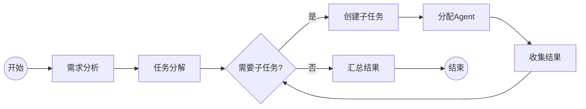

# 工作流编排技能

```mermaid
flowchart LR
    A((开始)) --> B[需求分析]
    B --> C[任务分解]
    C --> D{需要子任务?}
    D -->|是| E[创建子任务]
    E --> F[分配Agent]
    F --> G[收集结果]
    G --> D
    D -->|否| H[汇总结果]
    H --> I((结束))
```
